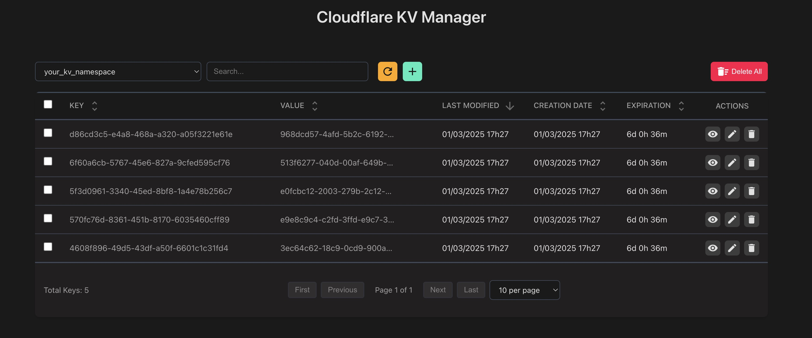
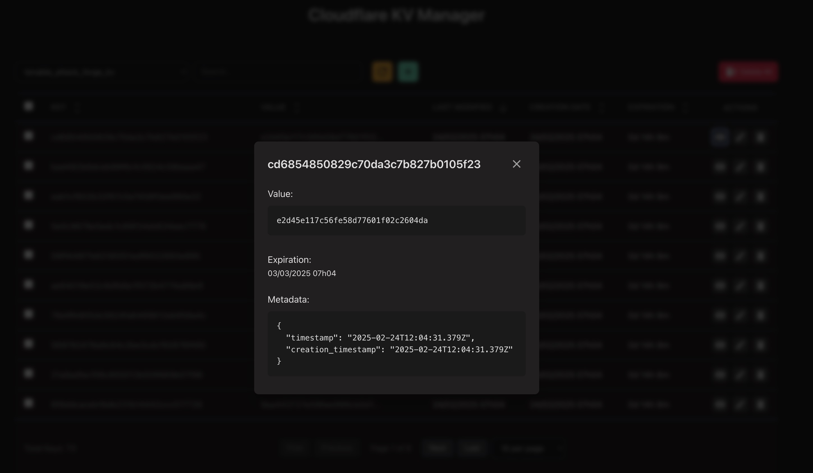
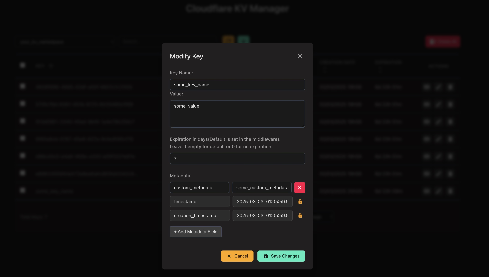

# Cloudflare KV Management

**Disclaimer:** This project is not affiliated with Cloudflare.

A more complete and simple solution for managing Cloudflare KV storage. One stop shop for managing your KV namespaces 🔥.

## Demo

You can see the demo of the UI [here](https://kv-demo.somecanadian.com/).

Things to note about the demo (not present if you deploy your own):

- Hardcoded expiration of 30 minutes for demo purposes.
- [Rate limiting](https://developers.cloudflare.com/workers/runtime-apis/bindings/rate-limit/) is enabled for the demo.
- Turnstile(captcha) is enabled for the `set` operation (adding or modifying a key).
- Demo version is on the `demo` branch.

## Features

- Comes with a small python library for easy integration 🐍
- Can be used without the UI
- Use as many namespaces as you want 🔄
- Search for keys in a namespace (search by key, value, or metadata) 🔍
- Add, edit, and delete keys 📝
- Supports view / edit metadata and expiration fields 👁️
- Delete all keys in a namespace 🗑️
- Delete a single key
- Filter
- Pagination

**Note:**

- No authentification is provided for the UI since you can use Cloudflare Zero Trust to protect it (see [customize-preview-deployments-access](https://developers.cloudflare.com/pages/configuration/preview-deployments/#customize-preview-deployments-access) and [enable-access-on-your-pagesdev-domain](https://developers.cloudflare.com/pages/platform/known-issues/#enable-access-on-your-pagesdev-domain)).
- Don't forget to set custom header and custom secret for the middleware.
- Supports Zero Trust for the middleware (you need to adjust config file to use custom domain and set workers_dev to false)

**Optional**

- Use custom domain for middleware and / or UI
- Protect UI with Zero Trust
- Restrict CORS policy






## Prerequisites

- wrangler cli (make sure it's logged in)
- One or more Cloudflare KV namespaces
- node and npm

## Installation

```bash
# clone the repo
git clone https://github.com/som3canadian/Cloudflare-KV-Manager.git
cd Cloudflare-KV-Manager

# copy the config files
cp templates/middleware_config.json workers/kv-management-middleware/wrangler.json
cp templates/ui_config.env workers/kv-management-ui/.env

# deploy the middleware
cd workers/kv-management-middleware
# modify the wrangler.json file
npm install
wrangler deploy
# set the WORKER_KV_SECRET
wrangler secret put WORKER_KV_SECRET

# deploy the ui
cd ../kv-management-ui
# modify the .env file
npm install
npm run deploy
# run the ui locally
# npm run preview

# go back to the root directory
cd ../../
```

## Configuration

### Middleware

- File: workers/kv-management-middleware/wrangler.json

```json
{
  "$schema": "node_modules/wrangler/config-schema.json",
  "name": "kv-management-middleware",
  "main": "src/index.js",
  "account_id": "<your-account-id>",
  "compatibility_date": "2025-01-29",
  "workers_dev": true,
  "preview_urls": false,
  "observability": {
    "enabled": true
  },
  "vars": {
    "DEFAULT_EXPIRATION_DAYS": 7,
    "CUSTOM_HEADER": "<your-custom-header>"
  },
  "kv_namespaces": [
    {
      "binding": "<your-kv-namespace-name>",
      "id": "<your-kv-namespace-id>"
    },
    {
      "binding": "<your-kv-namespace-name>",
      "id": "<your-kv-namespace-id>"
    },
    {
      "binding": "<your-kv-namespace-name>",
      "id": "<your-kv-namespace-id>"
    }
  ]
}
```

### UI

- File: workers/kv-management-ui/.env

```bash
VITE_APP_WORKER_URL=<your-worker-url>
VITE_APP_WORKER_KV_SECRET=<your-secret>
VITE_APP_CUSTOM_HEADER=<your-custom-header>
VITE_MIDDLEWARE_USE_ZERO_TRUST=false
VITE_MIDDLEWARE_SERVICE_AUTH_CLIENT_ID="<your-service-auth-client-id>"
VITE_MIDDLEWARE_SERVICE_AUTH_CLIENT_SECRET="<your-service-auth-client-secret>"
```

### Python Library

- File: lib/cf_kv.py

```python
this_kv_worker_url = "<your-worker-url>"
this_kv_worker_secret = "<your-secret>"
this_kv_worker_custom_header = "<your-custom-header>"
MIDDLEWARE_USE_ZERO_TRUST = False
MIDDLEWARE_SERVICE_AUTH_CLIENT_ID = "<your-service-auth-client-id>"
MIDDLEWARE_SERVICE_AUTH_CLIENT_SECRET = "<your-service-auth-client-secret>"
```

## Usage

### Using with the middleware only

```bash
# List all namespaces
curl -X GET "https://<your-worker-url>/namespaces" -H "X-Custom-Auth: <your-secret>"

# List all keys in a namespace
curl -X GET "https://<your-worker-url>/list?namespace=<namespace>" -H "X-Custom-Auth: <your-secret>"

# Get a key
curl -X GET "https://<your-worker-url>/get?key=<key>&namespace=<namespace>" -H "X-Custom-Auth: <your-secret>"

# Set a key with metadata and expiration
curl -X GET "https://<your-worker-url>/set?key=<key>&namespace=<namespace>&value=<value>&metadata=<metadata>&expiration=<expiration>" -H "X-Custom-Auth: <your-secret>"

# Set a key without expiration and metadata
curl -X GET "https://<your-worker-url>/set?key=<key>&namespace=<namespace>&value=<value>" -H "X-Custom-Auth: <your-secret>"

# Delete a key
curl -X GET "https://<your-worker-url>/delete?key=<key>&namespace=<namespace>" -H "X-Custom-Auth: <your-secret>"

# Delete all keys in a namespace
curl -X GET "https://<your-worker-url>/delete_all?namespace=<namespace>" -H "X-Custom-Auth: <your-secret>"

# List all namespaces with the middleware behind Zero Trust
curl -X GET "https://<your-worker-url>/namespaces" -H "X-Custom-Auth: <your-secret>" -H "Cf-Access-Client-Id: <your-service-auth-client-id>" -H "Cf-Access-Client-Secret: <your-service-auth-client-secret>"
```

### Using with the middleware and the UI

- Navigate to the URL of your CF Page

### Using the python library

```python
import lib.cf_kv as cf_kv

expiration_days = 5
metadata = {'custom_metadata': 'some_custom_metadata'}
namespace = 'my_namespace'

# List all namespaces
cf_kv.list_namespaces()

# List all keys in a namespace
cf_kv.list_kv_keys(namespace)

# Set a key with metadata and expiration
cf_kv.set_key_value('some_key_name', 'some_value', metadata, namespace, expiration_days)

# Get a key
cf_kv.get_key_value('some_key_name', namespace)

# Get a key with metadata
cf_kv.get_key_metadata('some_key_name', namespace)

# Delete a key
cf_kv.delete_key('some_key_name', namespace)

# Delete all keys in a namespace
cf_kv.delete_all_keys(namespace)
```

## TODO

- [ ] Add search endpoint to middleware (Only support with the UI for now)
